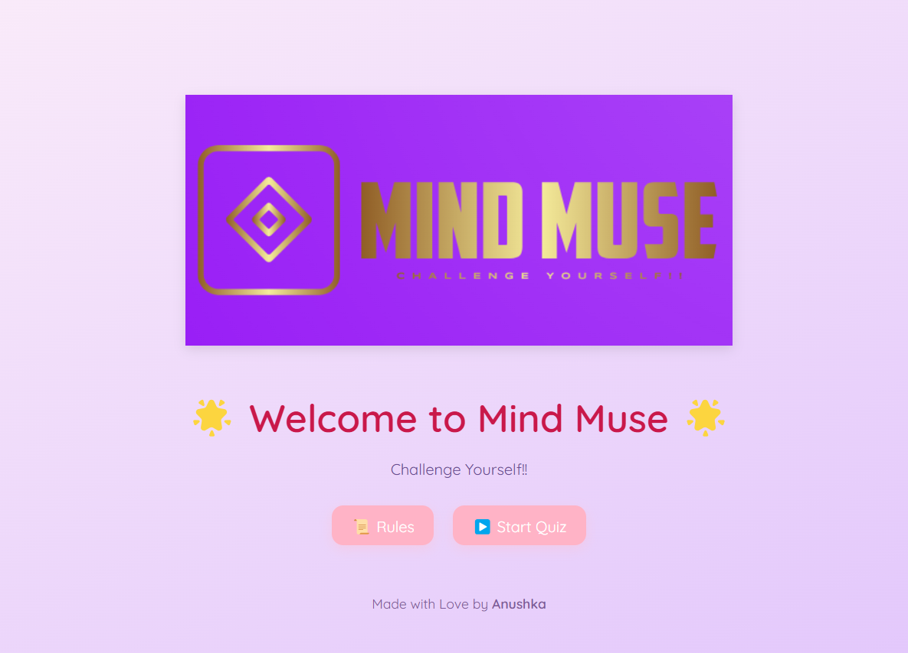
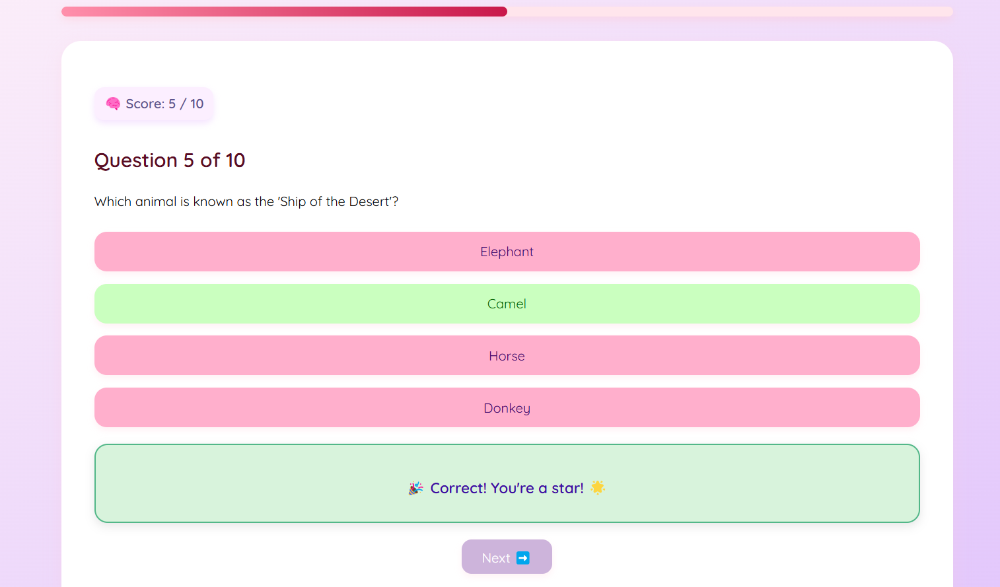
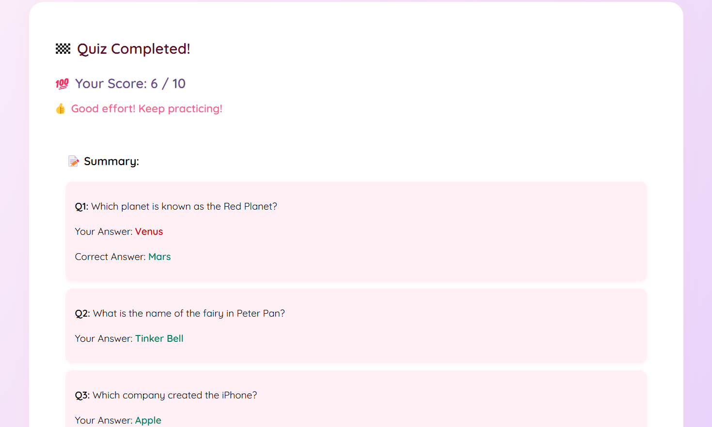

# 🌸 Mind Muse - A Fun and Aesthetic Quiz App

Welcome to **Mind Muse** — a beautiful, interactive, and exciting quiz application!  
Test your knowledge, get instant feedback, and see your final performance — all in a fun pastel-themed interface ✨

---

## 🚀 Live Site
👉 [Visit Mind Muse](https://mind-muse.vercel.app)

---

## 🎯 Features
- 🌸 Pretty welcome screen with custom logo and Start/Rules buttons
- 📜 Rule Book popup explaining how the quiz works
- 🧩 10 multiple choice questions
- 🎯 Immediate feedback after each question
- 🧠 Score tracker and animated progress bar
- 🎉 Summary of your performance at the end
- 🔄 Option to restart the quiz
- 📱 Fully responsive design (works on laptop and mobile)
- 🎶 Fun click and correct answer sounds
- 🌈 Pastel cute color theme

---

## 🛠 Built With
- React
- Vite
- Framer Motion
- HTML5 + CSS3 (Custom pastel styles)
- Hosted on Vercel

---

## 📸 Screenshots

| Welcome Screen | Quiz Screen | Summary Screen |
|:---:|:---:|:---:|
|  |  |  |

---

## 🧠 How to Use

1. Open the app and click **Start Quiz** 🎯
2. Read the rules if needed 📜
3. Answer 10 questions — get instant feedback after each!
4. See your final score and summary 🎉
5. Click **Restart Quiz** to play again 🔄

---

## 🎀 Developer

Made with Love by **Anushka**

---

## 📜 License

This project is open-source for learning purposes! 🎓  
Feel free to use, modify, and share with credits.

---

# 🌈 Thank You for Visiting Mind Muse!
