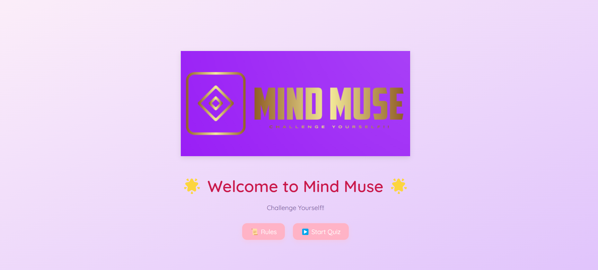

# 🧠 Mind Muse

**Mind Muse** is a beautiful and interactive quiz web app built with React and Vite.  
Designed with smooth animations, clean UI, and mobile responsiveness — it makes answering questions feel ✨fun and aesthetic✨.

> Created as part of my journey into frontend development and React! 💻🌸

---

## 🌟 Features

- 💡 **Start Screen** – Welcome users with the game name & logo  
- 📋 **Rule Book Popup** – Shows how the quiz works before it begins  
- 🧠 **Multiple-Choice Questions** – With instant feedback on answers  
- 📊 **Score Tracker** – Live score updates during the quiz  
- 📝 **Summary Section** – End-of-quiz results with all your answers  
- 🔄 **Restart Button** – Play again without refreshing  
- 📱 **Fully Responsive** – Looks great on both mobile and desktop  
- 💃 **Framer Motion** – Smooth animated transitions

---

## 🚀 Live Demo

👉 [mind-muse.vercel.app](https://mind-muse.vercel.app)

_(Try it on both desktop and mobile for the full experience!)_

---

## 🎥 Preview

## 🛠 Built With

- [React](https://reactjs.org/)
- [Vite](https://vitejs.dev/)
- [Framer Motion](https://www.framer.com/motion/)
- Custom CSS

---

## 💖 Made With Love By

**Anushka** `(@anushkaagr-2006)`  
Crafted with curiosity, caffeine, and lots of debugging 😌💅

---

## 📜 License

Open-source and free to use!  
Feel free to fork, explore, and create your own version 🌱

---

> ✨ Mind Muse was my very first React project — and I'm so proud of how far it's come 🥹
